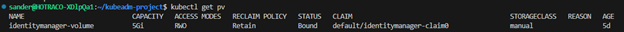
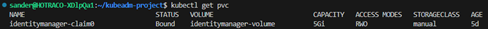
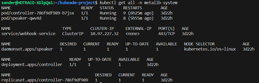
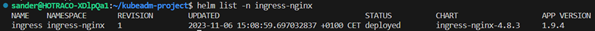
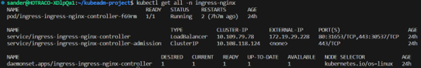
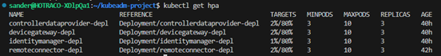

# README #

This README documents whatever steps are necessary to get your application up and running.

### What is this repository for? ###

* [Minimum hardware requirements](#markdown-header-minimum-hardware-requirements)
* [Recommended hardware requirements](#markdown-header-recommended-hardware-requirements)
* [Used versions](#markdown-header-used-versions)
* [Install Kubeadm](#markdown-header-install-kubeadm)
* [Install cluster on Kubeadm](#markdown-header-install-cluster-on-kubeadm)
* [Install load balancer and ingress](#markdown-header-install-load-balancer-and-ingress)
* [Install horizontal pod autoscaler](#markdown-header-install-horizontal-pod-autoscaler)
* [Kubernetes commands](#markdown-header-kubernetes-commands)
* [Miscellaneous](#markdown-header-miscellaneous)
* [References](#markdown-header-references)

### How do I get set up? ###

# Minimum hardware requirements
CPU: 2 cores

Memory: 2 GB RAM

Disk: 20 GB of free disk space

Operating System: Ubuntu Server 18.04 or later

# Recommended hardware requirements
CPU: 2 cores or more

Memory: 2 GB RAM or more

Disk: 20 GB of free disk space

Operating System: Ubuntu Server 18.04 or later

# Used versions
Ubuntu 20.04.6 LTS

Kubeadm v1.28.2

# Install Kubeadm
[kubernetes.io/docs/setup/production-environment/tools/kubeadm/install-kubeadm/](https://kubernetes.io/docs/setup/production-environment/tools/kubeadm/install-kubeadm/)

To install Kubeadm on Ubuntu and a Kubernetes cluster on a master node that can run pods, follow these steps.

Keep in mind that sudo- or root-rights are required to perform these actions.

**Step 1: Update your system**

Make sure your system is up-to-date by executing the following:

    sudo apt update
    sudo apt upgrade

**Step 2: Install Docker**

Kubernetes needs a container-runtime, Docker is a much used option. Install Docker by runing the following:

    sudo apt install docker.io

Start and activate the Docker-service:

    sudo systemctl start docker
    sudo systemctl enable docker

**Step 3: Install kubeadm, kubelet and kubectl**

Install the Kubernetes-components using the following commands:

    sudo apt-get update && sudo apt-get install -y apt-transport-https curl

    curl -s https://packages.cloud.google.com/apt/doc/apt-key.gpg | sudo apt-key add -

    echo "deb https://apt.kubernetes.io/ kubernetes-xenial main" | sudo tee /etc/apt/sources.list.d/kubernetes.list

    sudo apt update

    sudo apt install -y kubeadm kubelet kubectl

**Step 4: Initialise the master node**

On the master node run kubeadm init to initialise the Kubernetes control plane. You should specify a pod-network-add-on like Calico.

(Recommended) If you have plans to upgrade this singular control-plane Kubeadm-cluster to High Availability (HA), you should specify --control-plane-endpoint to configure an endpoint for all control-plane nodes. Such an endpoint can be a DNS-name or an IP-address of a loadbalancer.

    sudo swapoff -a

__Calico:__

    sudo kubeadm init --pod-network-cidr=192.168.0.0/16 --control-plane-endpoint=<IP> --upload-certs

After the initialisation process is completed, the output will give a command to run on your regular user account to configure kubectl for use on a new cluster. This will look like this:

    mkdir -p $HOME/.kube

    sudo cp -i /etc/kubernetes/admin.conf $HOME/.kube/config

    sudo chown $(id -u):$(id -g) $HOME/.kube/config

Run the given kubectl configuration commands.

**Step 5: Implement a pod-netwerk-add-on**

To run pods, you need a network solution. If you have specified a --pod-network-cidr during the kubeadm init, you could use the adjecent CNI-add-on (Container Network Interface). For Calico you can apply the manifest using:

    curl https://raw.githubusercontent.com/projectcalico/calico/v3.26.3/manifests/calico.yaml -O
    kubectl apply -f calico.yaml

**Step 6: Add a worker node (optional)**

When you want to add worker nodes to the cluster, you can run the kubeadm join command with the token that is given in the output of running kubeadm init on the master node.

    sudo Kubeadm token generate
    sudo kubeadm token create <your_token> --print-join-command

The next command is then given to join a worker node to the master node:

    sudo kubeadm join <your_master_node_ip>:6443 --token <your_token> --discovery-token-ca-cert-hash sha256:<your_ca_cert_hash>

**Step 7: Add master node / control plane (optional)**

    sudo kubeadm join <your_master_node_ip>:6443 --token <your_token> --control-plane --discovery-token-ca-cert-hash sha256:<your_ca_cert_hash>

**Step 8: Check the status of the cluster**

You can check the status of the cluster by running the following command:

    kubectl get nodes

# Install cluster on Kubeadm
[kubernetes.io/docs/setup/production-environment/tools/kubeadm/create-cluster-kubeadm/](https://kubernetes.io/docs/setup/production-environment/tools/kubeadm/create-cluster-kubeadm/)

To install a complete cluster on Kubeadm the following steps can be taken. A YAML file is needed for this with for instance a: Deployment, Service, Persistent Volume and a Persistent Volume Claim.

**Step 1: Deploy Persistent Volumes (PV) and Persistent Volume Claims (PVC)**

Define YAML files for Persistent Volumes and Persistent Volume Claims. For instance:

[Persistent Volume YAML file](ExampleYamlFiles/persistentvolume.yaml)

[Persistent Volume Claim YAML file](ExampleYamlFiles/persistentvolumeclaim.yaml)

Apply PV and PVC:

    kubectl apply -f pv.yaml
    kubectl apply -f pvc.yaml

To see whether or not it was succesful, check the PV and PVC via KUBECTL:

    kubectl get pv
    kubectl get pvc

PV and PVC should be “Bound”:

**Step 2: Deploy deployment**

Define YAML file for a Deployment. For instance:

[Deployment YAML file](ExampleYamlFiles/deployment.yaml)

  kubectl apply -f deployment.yaml

**Step 3: Deploy service**

Define YAML file for a Service. For instance:

[Service YAML file](ExampleYamlFiles/service.yaml)

  kubectl apply -f service.yaml

**Step 4: Create secret**

Define YAML file for a Secret. For instance:

[Secret YAML file](ExampleYamlFiles/secret.yaml)

This setup offers a simple Kubernetes cluster with Kubeadm, Deployments, Services, Persistent Volumes, Persistent Volume Claims and Secrets. These Kubernetes objects are not yet exposed to the outside. For this a Load Balancer and an Ingress are needed. For instance: MetalLB and Nginx. 

# Install load balancer and ingress
[metallb.universe.tf/installation/](https://metallb.universe.tf/installation/)

[https://kubernetes.github.io/ingress-nginx/deploy/](https://kubernetes.github.io/ingress-nginx/deploy/)

To reach our Kubernetes objects, we need an Ingress that maps domain names to IP addresses and a Load Balancer that can divide requests over multiple existing Kubernetes objects.

**Step 1: Preparation**

When stringARP is not yet enabled, enable this. This prevents spoofing.

    kubectl edit configmap -n kube-system kube-proxy

edit this:

[KubeProxyConfoguration YAML file](ExampleYamlFiles/kube-proxy-configuration.yaml)

**Step 2: Initialise MetalLB**

    kubectl apply -f https://raw.githubusercontent.com/metallb/metallb/v0.13.12/config/manifests/metallb-native.yaml

All MetalLB objects under the namespace metallb-system should look like this:

MetalLB needs an IP address pool of IP addresses it is allowed to assign:

[IPAddressPool YAML file](ExampleYamlFiles/ip-address-pool.yaml)

    kubectl apply -f ipaddresspool.yaml

MetalLB knows two modes, Layer 2 (L2) or Border Gateway Protocol (BGP). These two are both ways to route networks. L2 is better suited for a smaller cluster:

[L2Advertisement YAML file](ExampleYamlFiles/l2-advertisement.yaml)

    kubectl apply -f l2-advertisement.yaml

**Step 3: Add nginx repository**

For adding, updating and installing of the repository __helm__ can be used.

    helm repo add <NAME> https://kubernetes.github.io/ingress-nginx
    
    helm repo update
    
    helm install <NAME> ingress-nginx/ingress-nginx

**Step 4: Edit ingress-nginx.yaml file**

    helm show values ingress-nginx/ingress-nginx > ingress-nginx.yaml
    
    vim ingress-nginx.yaml

Enable hostNetwork and hostPort in the Controller section. This is needed because Kubeadm is a CNI based Kubernetes distribution. in __INSTALL KUBEADM__ we install Calico as our CNI:

[HostNetwork YAML file](ExampleYamlFiles/host-network.yaml)

Change Deployment to DaemonSet in the Controller section. This is needed because the ingress-nginx is a network related object that is run on each node:

[DaemonSet YAML file](ExampleYamlFiles/daemonset.yaml)

**Step 5: Create ingress-nginx**

    kubectl create namespace <NAMESPACE_NAME>
    helm install <NAME> ingress-nginx/ingress-nginx -n <NAMESPACE_NAME> --values ingress-nginx.yaml

When this is installed correctly, this will be shown:

**Step 6: Edit the hosts file**

The service __ingress-ingress-nginx-controller__ is now exposed as a Load Balancer with the IP address __172.19.29.228__. 

# Install horizontal pod autoscaler
[kubernetes.io/docs/tasks/run-application/horizontal-pod-autoscale/](https://kubernetes.io/docs/tasks/run-application/horizontal-pod-autoscale/)

[kubernetes.io/docs/tasks/run-application/horizontal-pod-autoscale-walkthrough/](https://kubernetes.io/docs/tasks/run-application/horizontal-pod-autoscale-walkthrough/)

[github.com/kubernetes-sigs/metrics-server](https://github.com/kubernetes-sigs/metrics-server)

[particule.io/en/blog/kubeadm-metrics-server/](https://particule.io/en/blog/kubeadm-metrics-server/)

For horizontal scaling of the pods Horizontal Pod Autoscaler can be used. The Horizontal Pod Autoscaler is implemented as a Kubernetes API resource and controller.

**Step 1: Install metrics server**

The Horizontal Pod Autoscaler needs resource information of the Kubernetes cluster. The metrics server allows resources of the Kubernetes cluster to be retrieved.

    kubectl apply -f https://github.com/kubernetes-sigs/metrics-server/releases/latest/download/components.yaml

**Step 2: Kubelet certificate**

Kubeadm does not work with metrics server out of the box. The error that is given would be this:

"Failed to scrape node": cannot validate certificate for IP because it doesn't contain any IP SANs

Metrics server tries to reach the Kubelet API but the TLS connection fails because the node IP address is not part of the Subject Alternative Name (SAN) certificate. This occurs because Kubelet certificates are self-signed. This can be solved by doing two things:

1.	Edit kubelet-config ConfigMap in the kube-system namespace 
and add: __serverTLSBootstrap: true__

    kubectl edit configmap -n kube-system kubelet-config

[ServerTLSBootstrap YAML file](ExampleYamlFiles/server-tls-bootstrap.yaml)

2.	On each node, edit /var/lib/kubelet/config.yaml and add: __serverTLSBootstrap: true__. This can be done using vim or nano.

    sudo vim /var/lib/kubelet/config.yaml
    //or
    sudo nano /var/lib/kubelet/config.yaml

[ServerTLSBootstrap YAML file](ExampleYamlFiles/server-tls-bootstrap.yaml)

**Step 3: Apply metrics-server.yaml**

Define a YAML file for the metrics server. For instance:

[APIService YAML file](ExampleYamlFiles/api-service.yaml)

    kubectl apply -f metrics-server-deployment.yaml

**Step 4: Calico network policy (Optional)**

When Calico is installed on the cluster, traffic between the metrics and the server should be enabled. This can be done with the following Network Policy YAML file:

[NetworkPolicy YAML file](ExampleYamlFiles/network-policy.yaml)

    kubectl apply -f metrics-server-network-policy.yaml

**Step 5: Test the metrics server**

    kubectl top nodes
    kubectl to pods
    kubectl get hpa

These commands should provide resource information. For instance:

You have now succesfully installed Horizontal Pod Autoscaler.

# Kubernetes commands
[kubernetes.io/docs/reference/kubectl/cheatsheet/](https://kubernetes.io/docs/reference/kubectl/cheatsheet/)

    kubectl get (pods|deployments|daemonsets|services|nodes|ingress|all|hpa|top pod|namespaces|persistentvolumeclaim|persistentvolume|l2advertisement|ipaddresspool| apiservice|secrets|configmaps)
    kubectl delete (pod|deployment|service|node|ingress|apiservice|namespace| persistentvolumeclaim|persistentvolume|l2advertisement|ipaddresspool|apiservice|secret) <NAME>
    kubectl get pod <POD_NAME>
    kubectl get all -A
    kubectl top (pod|node)
    kubectl get pods -n <NAMESPACE_NAME>
    kubectl get deployment <DEPLOYMENT _NAME> -o yaml
    kubectl get storageclass
    kubectl rollout restart deployment <DEPLOYMENT_NAME>
    kubectl describe pod <POD_NAME>
    kubectl logs <POD_NAME>
    kubectl describe node <NODE_NAME>
    kubectl apply -f <FILE_NAME>
    kubectl create -f <FILE_NAME>
    kubectl create namespace <NAMESPACE_NAME>
    kubectl edit (pod|deployment|daemonset|service|node|ingress|persistentvolumeclaim| persistentvolume|l2advertisement|ipaddresspool|apiservice|secrets|configmaps) <NAME>
    systemctl status kubelet
    systemctl stop kubelet
    systemctl start kubelet
    systemctl restart kubelet
    kubectl exec -it <POD_NAME> -- /bin/bash
    kubectl config get-contexts
    kubectl config use-context <CONTEXT_NAME>
    kubectl config view
    kubeadm init 
    kubeadm reset
    kubeadm create token
    kubeadm join 
    kubectl taint nodes <node-name> <taint-key>=<taint-value>:NoSchedule-
    kubectl get validatingwebhookconfigurations
    kubectl get mutatingwebhookconfigurations
    kubectl get endpoints

# Miscellaneous
    swapon -s 
    swapon –show 
    swapoff -a
    mount | grep /sys
    mount --make-shared /sys
    mount --make-shared / 
    mount -l | grep '/sys '
    findmnt -o TARGET,PROPAGATION /

    sudo cat >>/etc/sysctl.d/kubernetes.conf<<EOF
    net.bridge.bridge-nf-call-ip6tables = 1
    net.bridge.bridge-nf-call-iptables = 1
    EOF

    sysctl -w net.ipv4.ip_forward=1
    sysctl -w net.ipv4.ip_nonlocal_bind=1
    sudo su –
    kubeadm join <IP>:6443 –token <TOKEN> \ --discovery-token-ca-cert-hash <HASH>
    mkdir -p $HOME/.kube
    sudo cp -i /etc/kubernetes/admin.conf $HOME/.kube/config
    sudo chown $(id -u):$(id -g) $HOME/.kube/config
    sudo apt update
    sudo apt install -y docker.io
    sudo systemctl enable docker
    sudo systemctl start docker
    sudo journalctl -u kubelet
    sudo apt-get update
    sudo apt-get install -y docker.io
    sudo apt-get update && sudo apt-get install -y apt-transport-https curl
    curl -s https://packages.cloud.google.com/apt/doc/apt-key.gpg | sudo apt-key add -
    echo "deb https://apt.kubernetes.io/ kubernetes-xenial main" | sudo tee /etc/apt/sources.list.d/kubernetes.list
    which kubelet
    sudo crictl –version
    nslookup <API_SERVER_HOSTNAME>
    sudo systemctl stop kubelet
    sudo systemctl disable kubelet
    sudo netstat -tuln | grep 10250

# References
1. [kubernetes.io/docs/setup/production-environment/tools/kubeadm/install-kubeadm/](https://kubernetes.io/docs/setup/production-environment/tools/kubeadm/install-kubeadm/)

2. [kubernetes.io/docs/setup/production-environment/tools/kubeadm/create-cluster-kubeadm/](https://kubernetes.io/docs/setup/production-environment/tools/kubeadm/create-cluster-kubeadm/)

3. [metallb.universe.tf/installation/](https://metallb.universe.tf/installation/)

4. [https://kubernetes.github.io/ingress-nginx/deploy/](https://kubernetes.github.io/ingress-nginx/deploy/)

5. [kubernetes.io/docs/tasks/run-application/horizontal-pod-autoscale/](https://kubernetes.io/docs/tasks/run-application/horizontal-pod-autoscale/)

6. [github.com/kubernetes-sigs/metrics-server](https://github.com/kubernetes-sigs/metrics-server)

7. [particule.io/en/blog/kubeadm-metrics-server/](https://particule.io/en/blog/kubeadm-metrics-server/)

8. [kubernetes.io/docs/reference/kubectl/cheatsheet/](https://kubernetes.io/docs/reference/kubectl/cheatsheet/)

